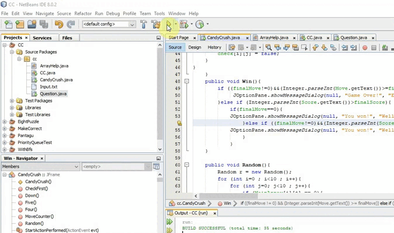

# Candy-Crush-Game

My 8th project was in the "Advance Programming" course at spring 2016 when I was in the 2nd semester of my bachelor's at IAUSTB. Candy Crush is a  match-three puzzle game. In the game, players complete levels by swapping colored pieces of candy on a game board to make a match of three or more of the same color, eliminating those candies from the board and replacing them with new ones, which could potentially create further matches. Matches of four or more candies create unique candies that act as power-ups with larger board-clearing abilities. Boards have various goals that must be completed within a fixed number of moves or a limited amount of time, such as a certain score or collecting a specific number of a type of candy. 

|  | 
|:--:| 
| *Sample Output* |

